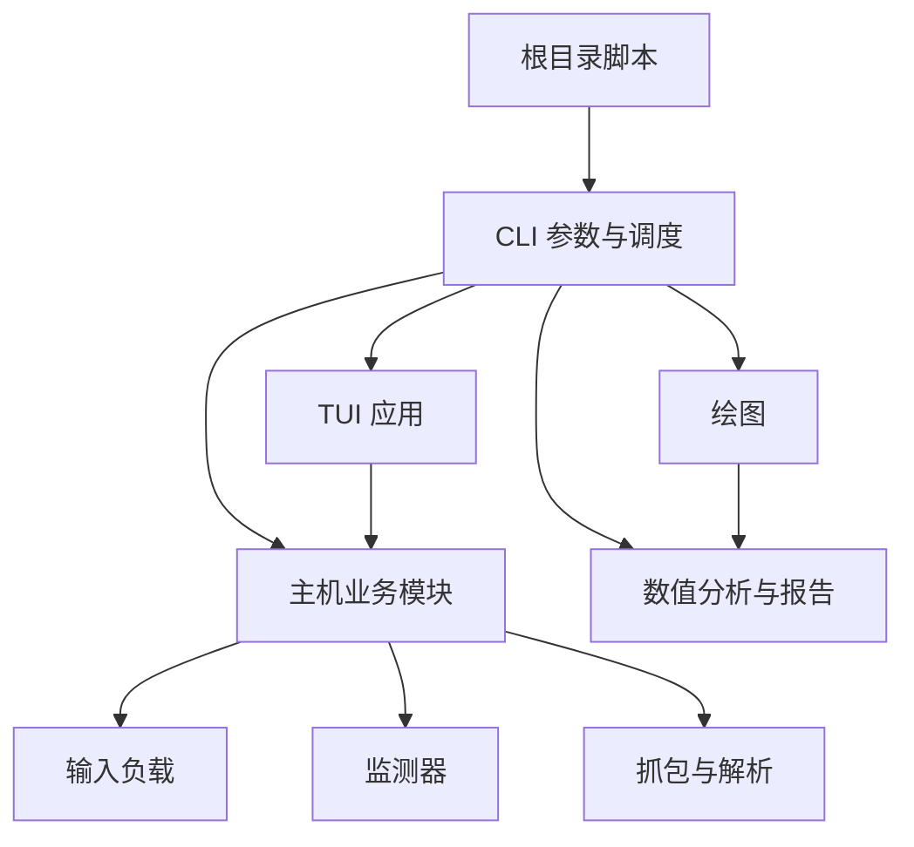

# AC-Prof 代码架构

AC-Prof 的命令入口负责参数和调度，业务模块按输入规划、运行时采集、结果分析与界面组织。
根目录脚本及旧 Python 导入路径保持兼容；新增调用应直接引用职责所属模块。

修改模块边界、依赖方向或兼容入口时查阅本文。操作说明见 [README](../README.md#项目结构与开发)，
字段与测量口径见 [指标与结果分析](Metrics.md#result_allcsv-字段解释)，运行环境扩展见[模型运行环境与适配器](Runtime_Compatibility.md)。

- [目录与职责](#目录与职责)：先定位实现模块。
- [入口与依赖方向](#入口与依赖方向)：检查导入关系和兼容边界。
- [主机编排与测量](#主机编排与测量)：追踪输入规划、镜像、采集窗口及 profiler。
- [结果分析与补采](#结果分析与补采)：定位 CSV 消费、拟合及补采写入。
- [TUI 与兼容维护](#tui-与兼容维护)：检查界面拆分、mock 位置和验证范围。

## 目录与职责

| 位置 | 职责 |
| --- | --- |
| `acprof/cli/` | 命令参数、入口调度、退出处理和兼容导出 |
| `acprof/tui/` | Textual 页面、事件、命令构造、进度、设置和日志控件 |
| `acprof/analysis/` | 延迟模型的数值计算、验证与报告文件 |
| `acprof/plotting/` | CSV 兼容整理、图表配置、颜色与渲染 |
| `acprof/host/` | 模型检测、环境预检、输入计划、容器与采集编排、profiler |
| `acprof/host/posthoc/` | 已有结果的 profiler 补采、回填、备份与回滚 |
| `acprof/container/` | 容器内模型下载、HTTP server、推理处理器和 profiler runner |
| `acprof/workloads/` | 各任务族的确定性输入与素材准备 |
| `acprof/monitors/` | 能耗、资源与 PMU 的原始测量 |
| `acprof/packet/` | 抓包解析及 packet latency 合并 |
| `acprof/config.py` | 共享配置、任务尺度及 CSV/静态元数据字段协议 |
| `acprof/artifacts.py`、`acprof/result_csv.py` | 原子产物发布、CSV 结构与测量唯一键校验；不初始化采集依赖 |
| `acprof/pixel_metrics.py` | 像素计数和能耗/延迟归一化的纯计算，由 client、packet 和 plotting 共用 |
| `acprof/runtime_profiles.py` | 运行环境、依赖锁与模型适配器的声明和元数据路由 |

## 入口与依赖方向



实现层不导入 `acprof.cli`。数值分析层不依赖绘图库；命令和配置模块不通过包初始化
提前加载 Textual。容器内推理与主机通过现有 HTTP、输入计划和产物协议交互。

`run.py`、`probe.py`、`profile.py`、`plot.py`、`tui.py` 和 `acprof-tui` 仍使用原命令。
`profile.py` 在被 Python 导入时继续代理标准库 `profile`，使 `cProfile` 正常工作。
`acprof.host.client`、容器 server/runner 和 packet 命令的模块路径保持原样。

## 主机编排与测量

| 模块 | 职责 |
| --- | --- |
| `preflight` | 原生 Linux、本机 Docker、cgroup 与 CPU 能耗前置检查 |
| `docker_runtime` | 镜像准备和构建、容器启停、ready 检查、冷启动分段及 OOM 状态读取 |
| `runtime_images` | 依赖层／模型层／代码层构建、内容指纹、环境清单核验及不可变 image ID |
| `runtime_validation` | 矩阵前的独立 CPU／GPU 完整推理验证及报告，不生成测量行 |
| `input_plan` | 手动和自动尺度规划、规划用 probe、payload 物化与输入计划写入 |
| `model_schema` | 任务输入输出描述与推理精度说明 |
| `static_metadata` | 主机、镜像、模型和 profiler 计划的静态元数据 |
| `packet_capture` | tcpdump 前置检查及 capture/parser 命令构造 |
| `orchestrator` | case/matrix 调度、idle 稳定性、失败与超时处理、OOM pruning 和 CSV 合并 |
| `run_state` | 目录锁、实验身份、已完成 case 校验、中断备份和恢复；仅在测量窗口外运行 |
| `client` | 环境与 workload 初始化、请求、对照窗口和正式窗口控制、结果写入 |
| `client_metrics` | 已完成采样结果到指标字段的纯计算与格式化 |
| `compute_profile` / `execution_profile` | profiler 计划、采集、断点与汇总；显式保留旧解析/查找入口 |
| `profilers/compute_parsers` / `profilers/execution_parsers` | Advisor/NCU CSV、Massif snapshot 和 Nsys stats 的纯标准库解析 |
| `profilers/tool_discovery` | 可执行文件、版本目录优先级和完整工具挂载路径 |
| `profilers/execution_environment` | 独立镜像与运行库核验、旧镜像兼容构建、工具版本查询 |
| `profiler_common` | 两类 profiler 共享的命令、容器参数、输入计划读取及原子 JSON 写入 |

`docker_runtime` 是输入规划的下层；`static_metadata` 引用 runtime、输入计划类型和
任务 schema；这些模块均不反向引用 `orchestrator`。它们的已有入口仍从
`orchestrator` 显式导出。两个 profiler 单向依赖 `profiler_common`，各自保留本地执行边界。
解析器不导入 Docker、模型检测或采集编排，单独读取报告无需安装推理框架。兼容导出直接引用
新模块中的函数；测试在函数实际查找依赖的位置 mock，不使用运行时 `globals` 转发。

`metric_registry` 统一 CSV 字段、单位、来源、窗口和 profiler 完成条件；`config.CSV_FIELDS`
保留同一列表对象。`analysis/audit` 和 `analysis/uncertainty` 负责只读审计与窗口统计，
根 `audit.py` / `stats.py` 仅处理参数和报告输出。生成的 `docs/Metric_Reference.md` 可在 CI 检查漂移。

指标模块不读取环境、不创建 workload 或 monitor。慢请求阈值由 client 在调用时显式传入；
冷启动状态仍由 client 管理。对照窗口、monitor 启停、正式请求和停止后的统计顺序保持一致。
界面刷新、绘图、通知与额外文件操作继续位于正式测量窗口之外。

`runtime_profiles` 是标准库声明层，主机检测只读元数据；handler 注册表供 server、输入规划和 profiler 共用。
`host.runtime_images` 负责环境、模型与最终代码的构建标识；`container.model_files` 是标准库文件规划器，
`download_model` 负责下载与构建期完整性检查，`runtime_manifest` 与 `runtime_validate` 分别负责环境清单和独立接口验证。
分层设计将权重下载与业务代码变更解耦；加载、镜像复用与验证契约见[运行兼容](Runtime_Compatibility.md#构建复用和验证)，
字段与历史兼容见[采集协议](Profiling_Protocol.md#static_metajson-字段)。

## 结果分析与补采

`analysis/latency_model.py` 负责拟合、预测与验证，`latency_report.py` 负责报告和残差数据。
`plotting` 内的 `config`、`data`、`styles` 分别管理图表声明、CSV 整理和样式；
`metrics`、`diagnostics`、`latency` 分别渲染常规指标、诊断图和模型图。

旧绘图入口保留函数签名及 `SHOW_PLOTS`、`SAVE_PNG`、`AGG_FUNC` 等配置行为，
通过短包装显式传给实现。`prepare_df` 的默认参数继续在函数定义时绑定。
CSV 字段、历史数据兼容、warmup/status 过滤、图表名称和模型计算口径保持一致。

补采包采用以下依赖关系：

```text
context ← backfill / plans / storage ← service ← CLI
```

- `context`：类型、常量、结果与 plan 读取、基础数值转换。
- `backfill`：结果行、静态元数据及 collection history 的更新计算。
- `plans`：工具适用性、完整性判断、计划复用、采集与合并。
- `storage`：活跃进程检查、锁、备份、临时文件发布与回滚。
- `service`：连接上述步骤的 `run_posthoc` 流程。

dry-run、已有数据完整性判断、计划复用、备份和发布顺序沿用既有语义。
项目根目录由 `context` 统一定位，避免更深的包目录影响 Dockerfile 和结果路径解析。

## TUI 与兼容维护

`app` 保留事件、状态和进程生命周期；`views` 使用页面构建函数输出原 TabPane 子树，
不增加包裹节点。`commands` 定义唯一的 `RunConfig` 及命令构造，`progress` 解析运行日志，
`diagnostics` 负责提示性预检和结果摘要。TUI 提示性检查与 CLI 权威检查保留各自用途。

settings、i18n、themes、input、log、scrollbar 各自管理设置、语言、主题和控件。
CSS 路径相对 App 文件明确定位；设置文件位置、版本、项目隔离算法和恢复优先级保持一致。
旧 `acprof.cli.tui*` 模块显式导出同一实现对象。

兼容层显式导出对象，不代理任意全局赋值；因此依赖 mock 的查找位置会随实现模块迁移，
旧路径仍用于入口兼容验证。测试选择、终端证据与验证范围统一见[测试指南](Testing.md)。
