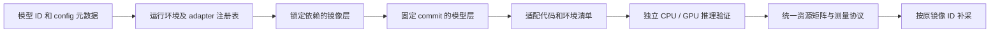

# 模型运行环境与适配器

AC-Prof 按模型选择运行环境和 adapter。不同 Transformers 版本安装在独立 Docker 依赖层，
主机只负责检测、规划和测量；新模型可以增加配置与 adapter，沿用已有采集协议。

## 当前配置

| 运行环境 | 选择条件 | 依赖与接口 |
| --- | --- | --- |
| `multimodal-transformers4576` | 已支持的原生 `multimodal` 模型 | Transformers 4.57.6；`family-default` handler |
| `moss-transformers560` | MOSS 官方模型 ID，或 `model_type=moss_transcribe_diarize` | Transformers 5.6.0；`moss-transcribe-diarize` adapter |
| `legacy-<family>` | 其它现有任务族 | 沿用原任务族 Dockerfile；新增实际包版本清单与镜像绑定 |

两个完整依赖锁位于 [`dockerfiles/locks`](../dockerfiles/locks)，包含传递依赖的精确版本，
使用 Python 3.10、PyTorch 2.11.0 和 CUDA 12.8 wheel；构建执行 `pip check` 并核验实际版本。
这两份锁在原生 Linux x86_64 环境验证，其它平台或 CUDA 组合需要相应的运行环境配置。
其它任务族尚未全部迁移为完整依赖锁，不能把它们的版本清单称为安装锁。
新结果均记录实际 Python／包版本及不可变 image ID。系统 apt 包和基础镜像 tag 尚未全部按
内容锁定，因此需要复现同一环境或补采时应保留原镜像，不能依赖重新构建得到字节相同的镜像。

支持任务标签不等于支持所有 checkpoint。已知不兼容的架构在任务预检退出；未登记的自定义
架构不会自动安装其 requirements 或执行主机端模型代码。通过静态检查的模型仍须完成实际
推理验证；CPU、GPU、dtype 和每种 profiler 的支持分别判断。

## MOSS 的执行约定

MOSS 的固定 snapshot 包含官方自定义模型、processor 和配置，adapter 仅在容器中以
`local_files_only=True` 加载这些代码。使用官方提示词和音频参数；processor 自行分块，
保留 `audio_feature_lengths` 和 `audio_chunk_mapping`，不因单块长度而截断整个请求。
同架构的其它 checkpoint 可沿用此 adapter，输入计划会传递所选 adapter 的默认提示词。

CPU 使用 FP32，GPU 使用 BF16；常规推理使用 SDPA，Torch FLOPs 的独立分析按现有约定
请求 eager attention。音频解码、特征计算和张量搬运在 `preprocess`，生成在 `predict`，
文本解码在 `postprocess`。输出沿用文本响应 schema，保留时间戳与说话人标记；不额外宣称
分段准确率或说话人识别准确率。默认 `max_new_tokens=512`，可通过 workload 清单调整。

## 构建、复用和验证

`prepare_image` 先将模型分支解析为完整 commit，再选择运行环境。镜像名称包含构建指纹，
指纹覆盖模型／任务／后端／环境声明、依赖锁、Dockerfile、AC-Prof Python 代码，以及旧任务族
显式指定的 Torch 构建参数。依赖、权重和代码分层构建，相同内容由 Docker 复用。

`--skip-build` 仅复用指纹和内部清单均匹配的镜像，执行引用固定为 Docker image ID。
查不到目标指纹则自动构建；已有标签内容不符会报错。构建期间代码变动会使构建失败，避免
用旧指纹标记新代码。旧 `:latest` 镜像可留存供历史实验使用，但不直接用于新环境的采集。

在正式资源矩阵之前，使用输入计划的最小尺度、最大已选 CPU／内存，为每个请求的设备模式
启动独立验证容器，执行完整的加载、预处理、推理和输出序列化。容器无网络，退出后清理。
验证错误和超时保留日志并退出；Docker 明确报告的 cgroup OOM 记为资源限制，允许矩阵继续。
验证不会写测量 CSV、计算能耗或充当正式 warmup。

验证会使宿主机文件缓存变热。正式 case 仍启动全新容器，冷启动指标表示该容器的进程／模型
初始化耗时，不承诺磁盘冷缓存。不要将验证耗时计入模型单请求或正式窗口。

`static_meta.json` v7 保存 `image_id`、`image_name`、`runtime_environment` 和成功返回的
`runtime_validation`；单独的 `runtime_validation.json` 与设备日志也保留失败信息。
历史 CSV／静态元数据按原样读取。补采有 `image_id` 时要求原镜像存在并匹配构建指纹，
不自动升级依赖，也不将工作区代码覆盖进该镜像。Torch、NCU、Massif、Nsys 的工具版本、
可用性、输出与错误继续由各自计划记录；普通推理成功不代表所有工具已验证成功。

## 新增一个模型适配

1. 检查上游代码、许可和已支持接口，确定任务、输入尺度、CPU／GPU 精度及依赖组合。
2. 在 [`runtime_profiles.py`](../acprof/runtime_profiles.py) 的 `PROFILES` 中声明环境、
   adapter、依赖锁、`task_types`、`model_types` 和 `backends`，再用 `ARCHITECTURE_PROFILES`
   或 `MODEL_PROFILES` 建立映射。可复用现有锁；新增组合应在目标 Python／CUDA 容器中解析、
   导出精确版本并执行 `pip check`，不能只填写 Transformers 的宽版本区间。
3. 若现有 handler 已满足接口，使用 `family-default`；否则实现 `BaseHandler` 四阶段协议，
   调用 `HandlerRegistry.register_adapter(name, family, backend, HandlerClass)`，并在
   `_auto_register` 导入该模块。模型特有的提示词／参数通过 workload 和输入计划传递。
4. 补齐路由、负载、输出 schema 及测量语义检查；先覆盖依赖不匹配、模态丢失、截断、失败
   日志和镜像错配等回归，再构建镜像并执行所支持设备上的真实推理和 profiler 验证。
5. 更新本文覆盖表与使用说明。CPU 或某个 profiler 尚未验证时明确记录，不将其它路径成功
   外推为该路径成功。

## 参考实现与取舍

构建配置参考 [Cog 的环境声明](https://github.com/replicate/cog/blob/main/docs/yaml.md) 和
[BentoML 的构建配置](https://github.com/bentoml/BentoML/blob/main/src/bentoml/_internal/bento/build_config.py)，
两者为 Apache-2.0。它们服务于各自的打包／服务框架；这里复用独立环境、依赖锁和内容缓存的
做法，沿用 AC-Prof 的 Docker 和四阶段 handler，无需引入新的服务框架或改变测量窗口。

MOSS 直接使用 [OpenMOSS 官方实现](https://github.com/OpenMOSS/MOSS-Transcribe-Diarize)，
默认提示词和调用约定参考其 `inference_utils.py`，许可为 Apache-2.0；模型代码与权重按
同一 snapshot 固定。该自定义接口与 Transformers 主版本相关，升级须重新锁依赖和验证。
所有安装、环境清单生成和接口验证都在正式测量窗口外完成。
